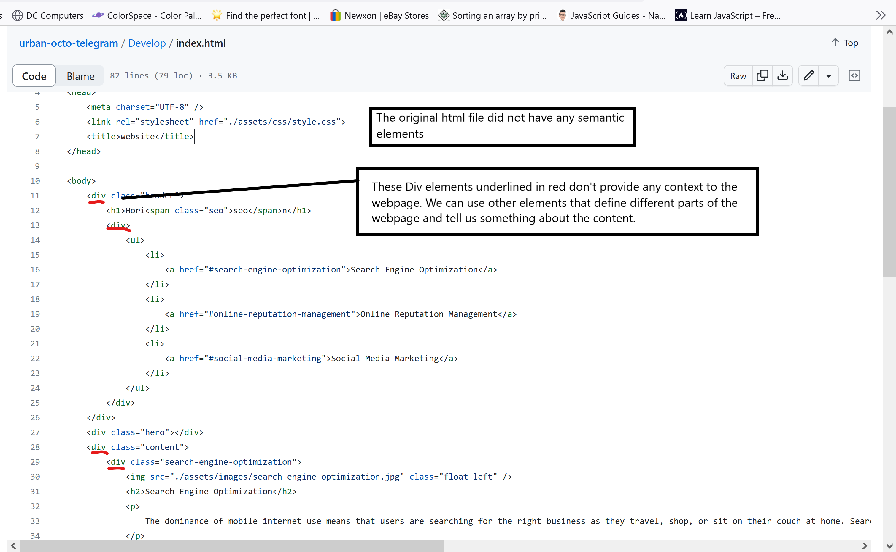
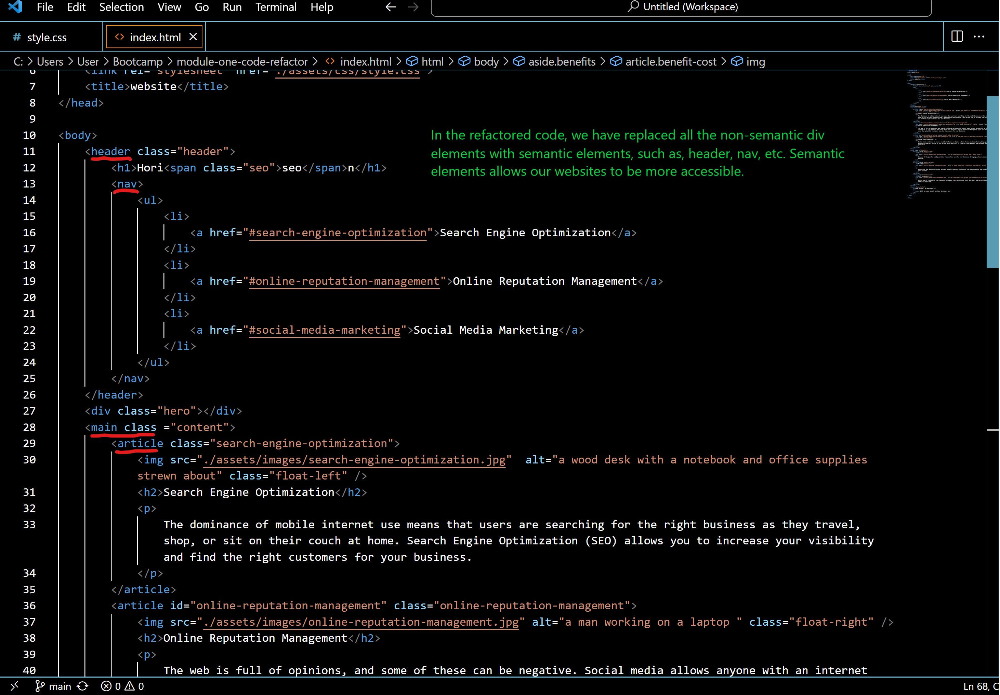
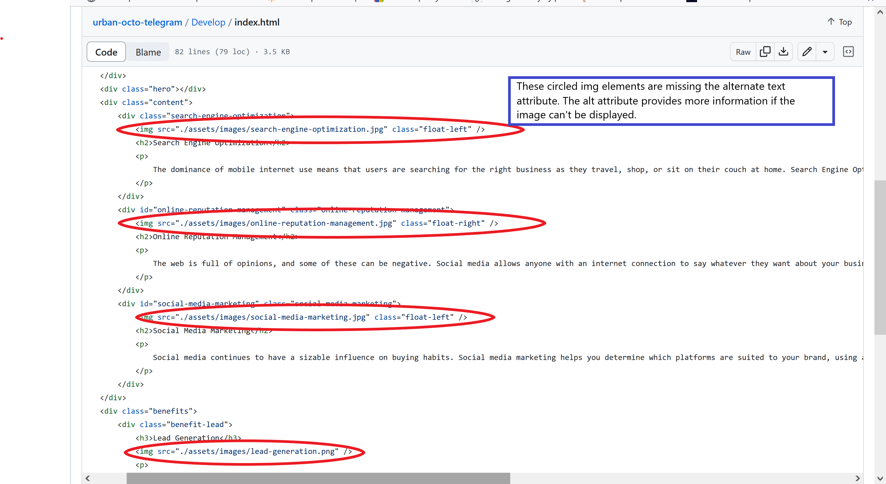
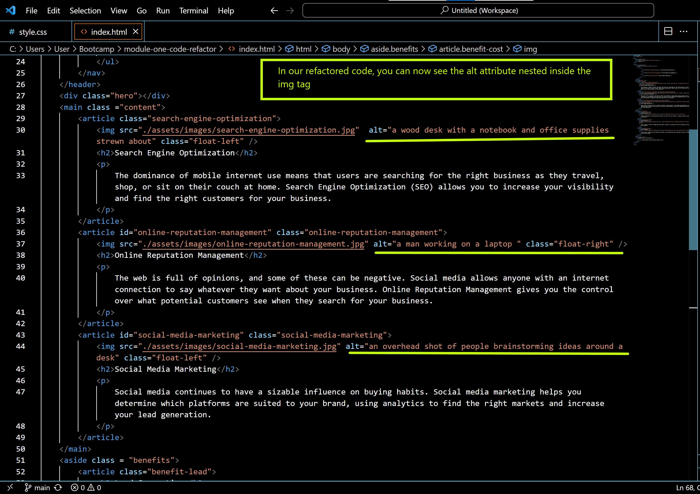

# module-one-code-refactor

## Description

I have created this guide for students in the Bootcamp to help them with semantic HTML. This guide contains the updated index HTML file, css stylesheet with comments on what each component of the code does along with pictures of the changes made to the HTML file. The purpose of this project is to provide a visual guide on how to give the html code more context in order to make it more readable and accessible for a greator user experience.

## Installation
N/A

## Usage

To use this guide to it's fullest, you can view the images uploaded on the README file that contains the index.html file without semantic HTML and with semantic HTML.This was done in order to give the user a visual on which code was refactored. You can also access the css stylesheet and view the comments on what code is responsible for each section of the website.  

## Screenshots

The picture below shows the original code without semantic HTML

In this image, we can see some of the semantic elements in the refactored code

In the original index.html the image elements were missing the alt attribute

The refactored code now has the alt attribute added to the image element

## Credits

N/A

## License
